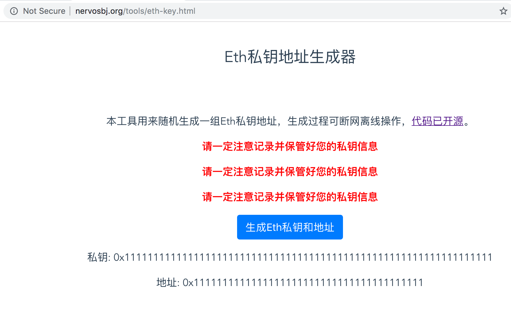
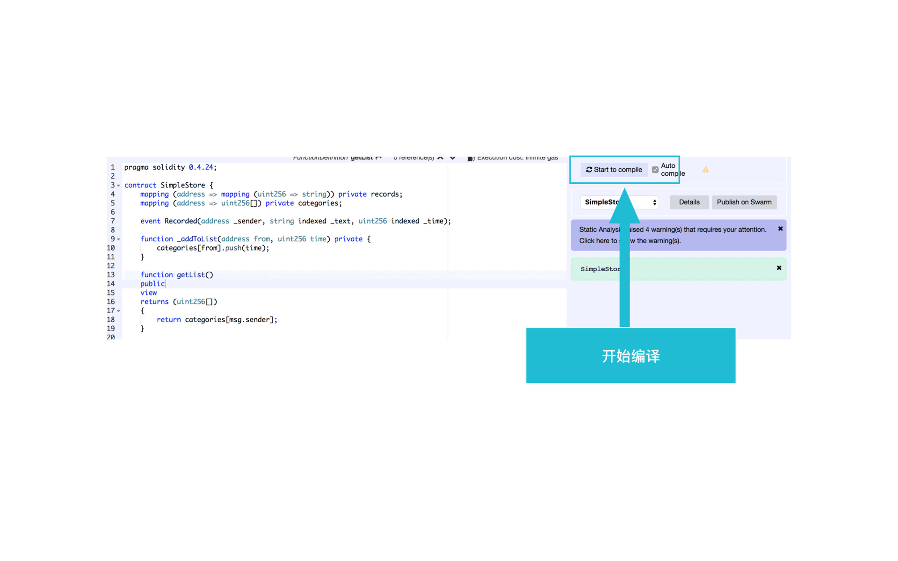
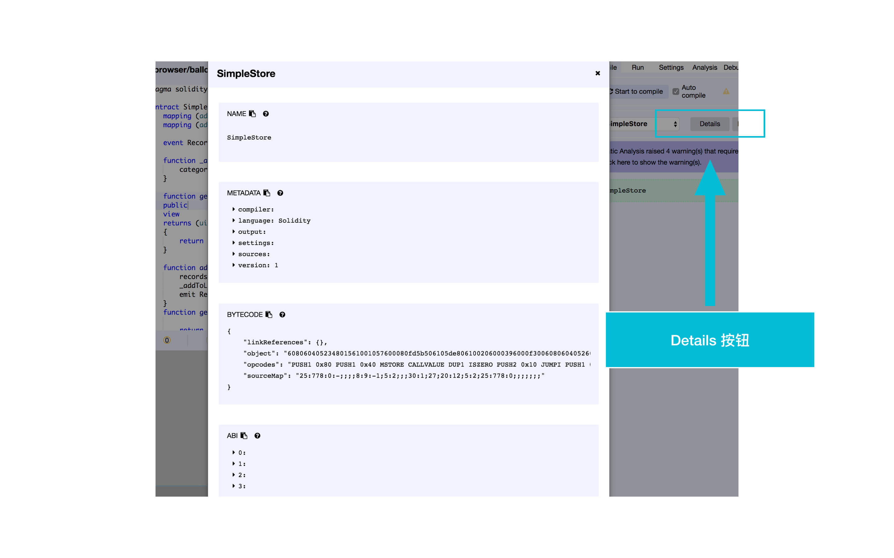
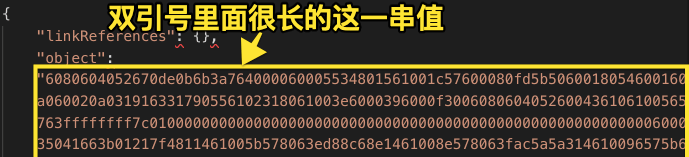
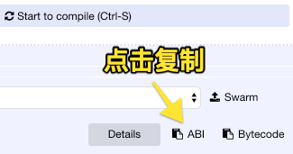
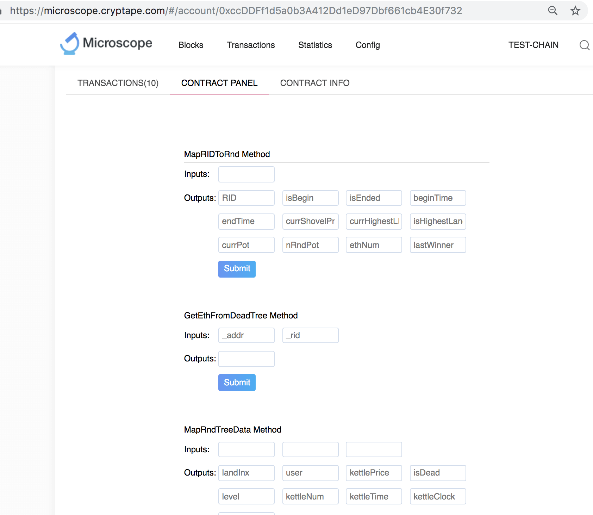
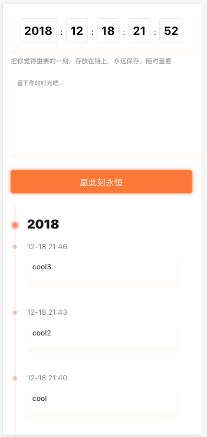

最终的代码可以参考：[first-forever-simplified](https://github.com/NervosBeijingCommunity/first-forever-simplified) 遇到问题如果短时间搞不定，可以参考上面的代码，运行命令：

```
npm install && npm start
```
应该就可以将app跑起来了。

## 0 环境安装
### 操作系统
推荐使用Mac或者Ubuntu。

如果使用 **Windows，可以使用虚拟机在Windows系统中安装一个Linux的Ubunut系统，** 2种做法都可以：
* 虚拟机VirtualBox官网下载 [https://www.virtualbox.org/wiki/Downloads](https://www.virtualbox.org/wiki/Downloads)，并安装ubunut镜像。
* 开启 Windows 10 的 Linux 子系统并安装Ubunut镜像，切记是Windows10，不是Windows8，也不是Windows7，版本不能低于Window10，参考： [https://www.jianshu.com/p/UpwXzQ](https://www.jianshu.com/p/UpwXzQ)。

### 安装node
直接下载[Node.js](https://nodejs.org/)

如果熟悉命令行，可以用 [nvm](https://github.com/creationix/nvm) 安装Node.js

命令如下：

```
curl -o- https://raw.githubusercontent.com/creationix/nvm/v0.34.0/install.sh | bash

nvm install v10.15.0 # 安装v10.15.0版本的nodejs
```

安装完之后，把npm的官方源替换为淘宝源，国内使用淘宝源下载速度会更快。

`npm config set registry http://registry.npm.taobao.org/`

### 安装代码编辑器 vscode 稳定版，即Stable版

下载[Visual Studio Code稳定版](https://code.visualstudio.com/)

## 1 创建项目
在命令行运行如下命令，安装 create-react-app 工具：

```
npm install create-react-app -g # g是global的缩写，即全局的意思
```

**教练**：解释一下什么是npm和package？

##########################成功日志##########################
Success! Created bigtree at ~/bigtree
Inside that directory, you can run several commands:

  yarn start
    Starts the development server.

  yarn build
    Bundles the app into static files for production.

  yarn test
    Starts the test runner.

  yarn eject
    Removes this tool and copies build dependencies, configuration files
    and scripts into the app directory. If you do this, you can’t go back!

We suggest that you begin by typing:

  cd bigtree
  yarn start

Happy hacking!
##########################成功日志##########################

在命令行运行如下命令，创建项目：

```
create-react-app bigtree
```
会创建一个名为bigtree的项目文件夹

**教练**：解释一下上面都做了什么？

在命令行中运行如下命令：

```
cd bigtree
npm install @cryptape/cita-sdk --save
```

##########################成功日志##########################
+ @cryptape/cita-sdk@0.23.0

added 366 packages from 306 contributors, removed 426 packages, updated 1286 packages in 194.168s
found 2 high severity vulnerabilities
##########################成功日志##########################

如果有如下错误提示：

```
npm ERR! code ELiFECYCLE
npm ERR! errno 1
npm ERR! scrypt@6.0.3 install: `node-gyp rebuild`
npm ERR! Exit status 1
```

请看[node-gyp安装问题](./qa.md)

执行`npm start`，几秒钟后会自动打开一个网页 `http://localhost:3000/`，表明项目初始化并运行成功。

**教练**：介绍一下什么是React和HTML有什么关系？

## 2 申请测试链代币

### 生成账户

访问网址获取私钥和地址：
http://nervosbj.org/tools/eth-key.html



将生成的私钥和地址保存好，后面会用到。

**不要将这里获取的私钥跟地址，当自己的钱包地址用来接收交易**
**不要将这里获取的私钥跟地址，当自己的钱包地址用来接收交易**
**不要将这里获取的私钥跟地址，当自己的钱包地址用来接收交易**

特别注意，私钥 privateKey 是不能泄露给任何人的。上面这个账户就是临时用一下，所以无所谓了。
于是，account 就到手了。

**教练**：
解释一下什么是加密货币钱包？
地址和私钥是什么？
为什么私钥很重要？

参考：https://learning.nervos.org/nerv-first/6-wallet

### 充值

使用浏览器打开网页 https://dapp.cryptape.com/faucet/)，然后输入上一步得到的地址(address)，点击 *Get Testnet Token*
按钮就可以获取免费的代币了。


然后，到 AppChain 的区块链浏览器，也就是 [microscope.cryptape.com](http://microscope.cryptape.com/) 上，输入账户地址（address），就可以查询到账户余额了。

这样账户中就有了余额，后续操作就都可以顺利进行了。


**教练**：解释一下什么是Nervos？解释一下什么是区块链浏览器？

参考：https://learning.nervos.org/nerv-first/2-nervos
Nervos 是一个网络，分上下两层，底层的 CKB 负责安全和共识，上层的各种方案保证性能。Nervos 要为各个企业搭建自己的公链和开发 DApp 提供成套的基础设施，让大家直接上手就能实现自己的想法，而不必重新造轮子。

## 3 部署智能合约

使用代码编辑器打开创建的bigtree文件夹，在文件夹src/下创建一个文件config.js，添加如下代码：

```
const config = {
  chain: 'https://node.cryptape.com',
  contractAddress: '', // 暂时留空，后面会添加
  fromAddress: 'YOUR_ADDRESS',
  privateKey: 'YOUR_PRIVATE_KEY'
}
module.exports = config
```
将fromAddress, privateKey(私钥)替换成自己的，contractAddress在后面部署合约成功后再添加。

这样配置文件就写好了。

在文件夹 `src/`下创建一个文件 `nervos.js`，添加如下代码：

```
const {
  default: Nervos
} = require('@cryptape/cita-sdk')

const config = require('./config')

const nervos = Nervos(config.chain) // config.chain indicates that the address of Appchain to interact
const account = nervos.base.accounts.privateKeyToAccount(config.privateKey) //create account by private key from config

nervos.base.accounts.wallet.add(account)

module.exports = nervos
```

创建 nervos.js 文件，初始化 nervos 对象。通过使用`config.chain`，指定了要跟哪条区块链进行交互。privateKeyToAccount 用私钥生成 account。
通过 wallet.add 接口把 account 添加到了 nervos 对象中并最终导出。

在文件夹`src/`下创建一个文件`simpleStore.js`，添加如下代码：

```
const nervos = require('./nervos')
const {
  abi
} = require('./contracts/compiled.js')
const {
  contractAddress
} = require('./config')

const transaction = require('./contracts/transaction')
const simpleStoreContract = new nervos.base.Contract(abi, contractAddress)
module.exports = {
  transaction,
  simpleStoreContract
}
```

**合约的编译：**
**注意：编译器版本选择0.4.26，最新的编译器版本会有问题。**

打开网址 https://remix.ethereum.org/ 将下面的代码粘贴到remix的代码编辑区域中，

**获取合约代码：**  
从这个网址得到：https://github.com/NervosBeijingCommunity/first-forever-simplified/blob/bigtree/combined.sol

**教练**：介绍一下智能合约和Solidity？

参考：
https://learning.nervos.org/nerv-first/3-dev
https://learning.nervos.org/nerv-first/4-sol



然后点右侧的 start to compile进行编译。这里需要注意，有的时候需要稍微提高一下合约声明的版本号，才能编译通过。



编译的输出可以通过点 details 按钮得到，这样合约就编译好了。

在文件夹`src/`下创建文件夹`contracts`，然后再文件夹中创建一个文件`compiled.js`，并添加如下代码：

```
// deploy/compiled.js
const bytecode = '稍后替换成真正的值'
const abi = '稍后替换成真正的值'
module.exports = {
    abi,
    bytecode
}
```

其中 bytecode 一项，就是 remix 最终编译结果中 bytecode 一项下的 **object 那个字段的值**，
是一个长长的字符串，这点要注意，不要把全部内容都复制过来。如下图所示，就是 "6080..." 开始的这个双引号中的值。



而 abi 一项就是一个数组，就直接在 remix 界面中的 abi 一项下，直接点 copy 图标。



然后把拷贝到的内容粘贴到 compiled.js 文件中即可。

我在 Github 上也上传了一个真实可用的版本供大家参考：https://github.com/NervosBeijingCommunity/first-forever-simplified/blob/bigtree/src/contracts/compiled.js 。

在文件夹`src/contracts/`下创建一个文件`transaction.js`，添加如下代码：
```
const nervos = require('../nervos')

const transaction = {
  from: nervos.base.accounts.wallet[0].address,
  privateKey: nervos.base.accounts.wallet[0].privateKey,
  nonce: 999999,
  quota: 1000000 * 10,
  chainId: 1,
  version: 1,
  validUntilBlock: 999999,
  value: '0x0'
};

module.exports = transaction
```

创建 `transaction.js` 文件, from 一项指定了我们自己账户的地址。注意这里没有 to 也就是没有接收方。privateKey 一项用来指定私钥。
**特别说明一下，私钥是不能暴露给任何人的，这里为了演示方便，我们直接把私钥写到了代码中，但是实际的 DApp 一般都是开源软件，所以私钥是不能写到代码中的。**
AppChain 的解决方式是把私钥保存到 Neuron 钱包中，需要进行交易的时候，让代码跟 Neuron 交互来完成签名。
当然，我们这里先不涉及 Neuron ，暂时把私钥写到了代码中。value 是交易数额，这里设置为0。
后面的 quota，nonce ，chainId ，version ，validUntilBlock 都是跟交易安全相关的设置，可以到 CITA 的官方文档上，
找到各自的含义：https://docs.citahub.com/zh-CN/cita/configuration/service-config#rpc。

在文件夹`src/contracts/`下创建一个文件`deploy.js`，添加如下代码：

```
const nervos = require('../nervos')
const {
  abi,
  bytecode
} = require('./compiled.js')

const transaction = require('./transaction')
let _contractAddress = ''
// contract contract instance
const myContract = new nervos.base.Contract(abi)

nervos.base.getBlockNumber().then(current => {
    transaction.validUntilBlock = +current + 88 // update transaction.validUntilBlock
    // deploy contract
    return myContract.deploy({
      data: bytecode,
      arguments: [],
    }).send(transaction)
  }).then(txRes => {
    if (txRes.hash) {
      // get transaction receipt
      return nervos.listeners.listenToTransactionReceipt(txRes.hash)
    } else {
      throw new Error("No Transaction Hash Received")
    }
  })
  .then(res => {
    const {
      contractAddress,
      errorMessage,
    } = res
    if (errorMessage) throw new Error(errorMessage)
    console.log(`contractAddress is: ${contractAddress}`)
    _contractAddress = contractAddress
    return nervos.base.storeAbi(contractAddress, abi, transaction) // store abi on the chain
  }).then(res => {
    if (res.errorMessage) throw new Error(res.errorMessage)
    return nervos.base.getAbi(_contractAddress, 'pending').then(
      res => {
      console.log(res)
      console.log(`\n\n contractAddress is: ${_contractAddress}`)
      }
    ) // get abi from the chain
  }).catch(err => console.error(err))
```

创建 deploy.js，用来 deploy 字节码，然后就可以从 receipt 也就是回执中，得到合约地址并打印出来。
通过 storeAbi 接口把合约 ABI 发送到链上。具体各个接口的描述可以参考：[@cryptape/cita-sdk](https://www.npmjs.com/package/@cryptape/cita-sdk)。

在命令行运行命令：
```
node src/contracts/deploy.js
```
部署成功，可以看到打印出了合约地址和 ABI 信息。

```
...
...
...

contractAddress is: 0xccDDFf1d5a0b3A412Dd1eD97Dbf661cb4E30f732
```
然后打开连接 https://microscope.cryptape.com/ 搜索打印出的合约地址，发现出现的是一个 Account，
下面有 Contract Panel 一项。点开，可以看到合约代码中对应的接口的相关界面。



打开`src/config.js`文件，修改`contractAddress` 的值为上面得到的合约地址：

```
const config = {
  chain: 'https://node.cryptape.com',
  contractAddress: '上面得到的合约地址',  // 修改这一行
  fromAddress: 'YOUR_ADDRESS',
  privateKey: 'YOUR_PRIVATE_KEY'
}
module.exports = config
```

这样我们合约部分的代码就完成了。

## 4 与合约交互

清空`src/App.js`文件内容，并添加如下代码：

```
// src/App.js

```

清空`src/App.css`文件内容，并添加如下代码：

```

```

回到浏览器中，查看页面，如下图所示。这时就可以添加文字并提交到区块链了，刷新页面后就可以看到最新添加的文字了。



恭喜你，完成了一个完整的DApp！
